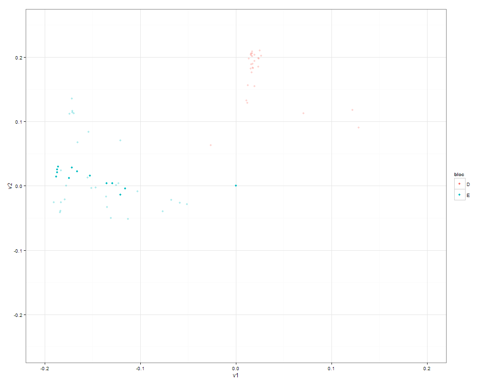

R-hklegcovote
=============

Visualisation of voting patterns of the Legislative Council of Hong Kong using R.

Inspired by [How divided is the Senate?](http://vikparuchuri.com/blog/how-divided-is-the-senate/) and [Visualization of voting behaviour in the 17th German Bundestag](http://www.joyofdata.de/blog/visualization-of-voting-behaviour-in-the-17th-german-bundestag/).

---

# Required packages
- [ggplot2](http://ggplot2.org/)

---
# Example plots

A plot highlighting all DAB members' voting pattern.
R Code:
    ggplot(dataf,aes(x=v1,y=v2,color=bloc))+xlim(-0.2,0.2)+ylim(-0.25,0.25)+geom_point(alpha=0.3)+geom_point(data=subset(dataf, affi=="DAB"))+theme_bw()

